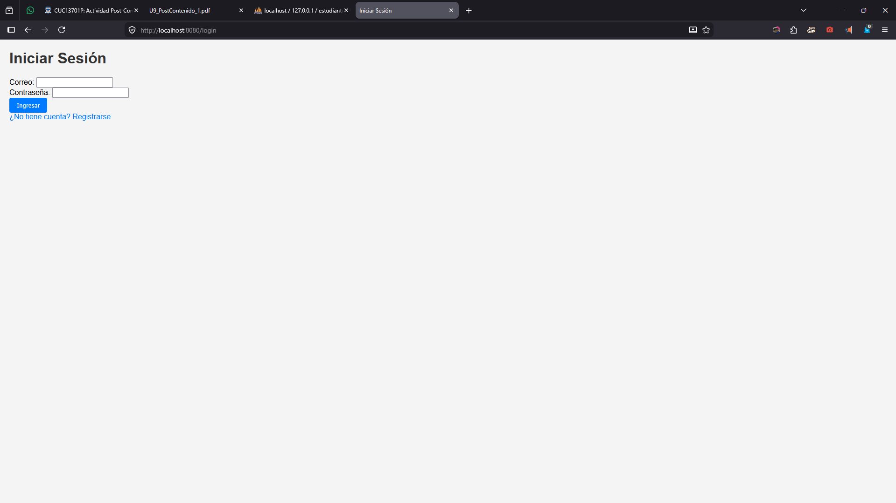
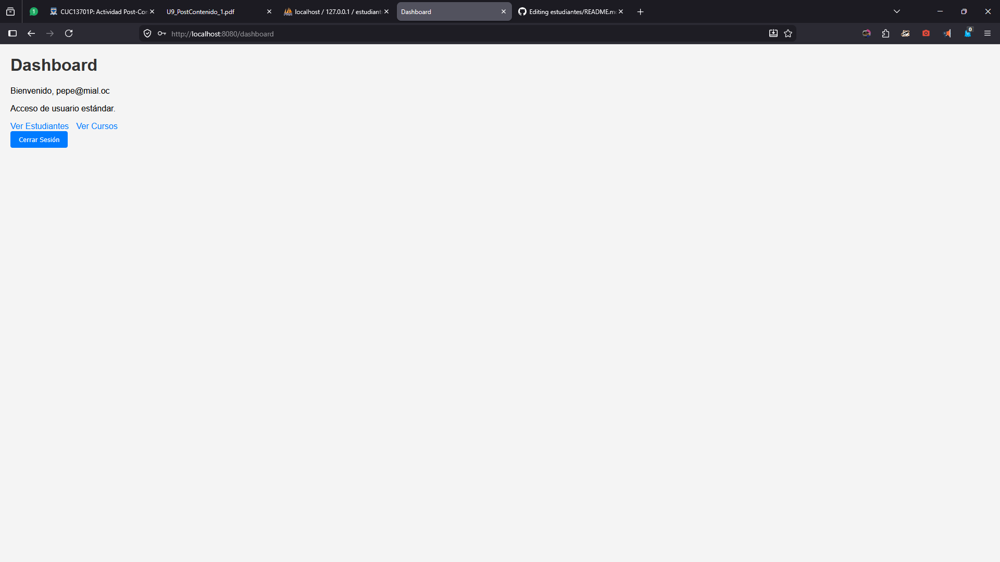
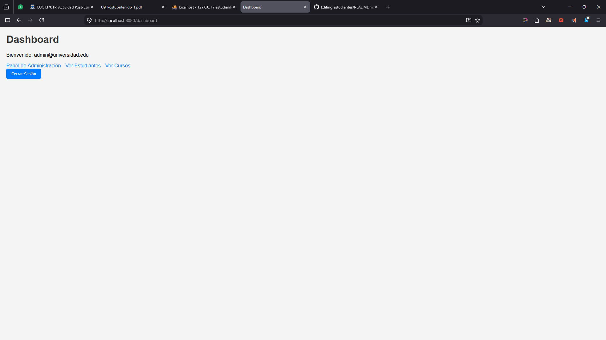
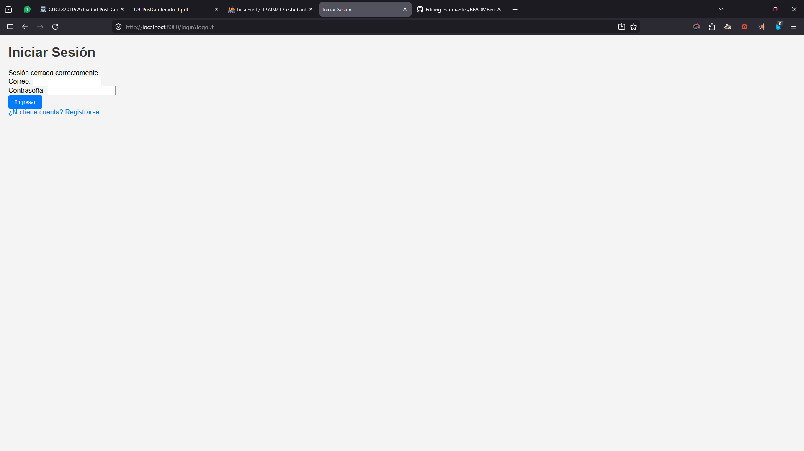
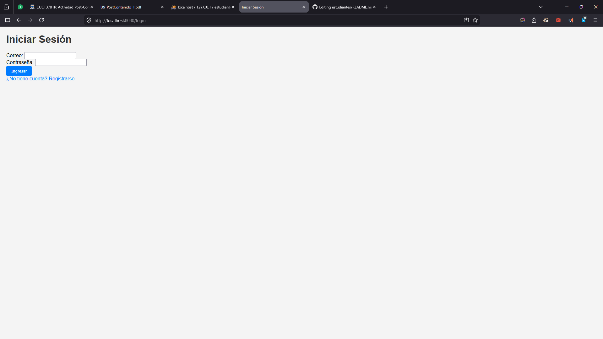

# Estudiantes - Sistema de Gestión Universitaria

Una aplicación web Spring Boot para gestionar estudiantes y cursos en una universidad, con autenticación de usuarios, registro y control de acceso basado en roles.

## Características

- Registro e inicio de sesión de usuarios con hash de contraseñas BCrypt
- Seguridad basada en roles (roles USER y ADMIN)
- Panel de control para usuarios autenticados
- Panel de administración para gestionar usuarios
- Gestión de estudiantes (operaciones CRUD)
- Gestión de cursos (operaciones CRUD)
- Inscripción de estudiantes en cursos
- Plantillas Thymeleaf con estilos CSS básicos

## Tecnologías Utilizadas

- Java 17
- Spring Boot 3.2.5
- Spring Security
- Spring Data JPA
- Base de Datos MySQL
- Thymeleaf
- Maven

## Prerrequisitos

- Java 17 o superior
- Maven 3.6+
- MySQL 8.0+

## Instalación y Configuración

1. Clona el repositorio:
   ```bash
   git clone <url-del-repositorio>
   cd estudiantes
   ```

2. Configura la base de datos MySQL:
   - Crea una base de datos llamada `estudiantes`
   - Actualiza `src/main/resources/application.properties` con tus credenciales de MySQL:
     ```
     spring.datasource.url=jdbc:mysql://localhost:3306/estudiantes
     spring.datasource.username=tu_usuario
     spring.datasource.password=tu_contraseña
     ```

3. Ejecuta la aplicación:
   ```bash
   ./mvnw spring-boot:run
   ```

4. Accede a la aplicación en `http://localhost:8080`

## Usuario Administrador por Defecto

La aplicación crea un usuario administrador por defecto al iniciar:
- Correo: admin@universidad.edu
- Contraseña: admin123

## Puntos de Control

### Punto de Control 1
La aplicación arranca sin errores. Al navegar a http://localhost:8080/dashboard,
Spring Security redirige automáticamente a /login. La página de login muestra el
formulario personalizado, no el de Spring por defecto.




### Punto de Control 2
Registrar un nuevo usuario desde /registro. Verificar en MySQL que la contraseña
guardada es un hash BCrypt (comienza con $2a$12$). Iniciar sesión con las
credenciales registradas y confirmar que el dashboard muestra el nombre del
usuario. Intentar acceder a /admin con el usuario USER y verificar que Spring
Security muestra error 403 Forbidden.



### Punto de Control 3
Iniciar sesión como admin@universidad.edu. Verificar que /admin es accesible y
muestra la lista de usuarios. Cerrar sesión con el botón "Cerrar Sesión" y verificar
que Spring Security invalida la sesión y redirige a /login?logout. Intentar acceder
a /dashboard después del logout y verificar que redirige a /login.





## Estructura del Proyecto

```
estudiantes/
├── src/main/java/com/universidad/estudiantes/
│   ├── config/
│   │   └── SecurityConfig.java
│   ├── controller/
│   │   ├── AuthController.java
│   │   ├── CursoController.java
│   │   └── EstudianteController.java
│   ├── model/
│   │   ├── Curso.java
│   │   ├── Estudiante.java
│   │   └── Usuario.java
│   ├── repository/
│   │   ├── CursoRepository.java
│   │   ├── EstudianteRepository.java
│   │   └── UsuarioRepository.java
│   └── service/
│       ├── CursoService.java
│       ├── EstudianteService.java
│       └── UsuarioService.java
├── src/main/resources/
│   ├── static/css/
│   │   └── style.css
│   ├── templates/
│   │   ├── auth/
│   │   │   ├── dashboard.html
│   │   │   ├── login.html
│   │   │   ├── panel.html
│   │   │   └── registro.html
│   │   ├── cursos/
│   │   │   ├── formulario.html
│   │   │   ├── inscribir.html
│   │   │   └── lista.html
│   │   └── estudiantes/
│   │       ├── confirmar-eliminar.html
│   │       ├── formulario.html
│   │       └── lista.html
│   └── application.properties
├── pom.xml
└── README.md
```


## Licencia

Este proyecto está licenciado bajo la Licencia MIT.